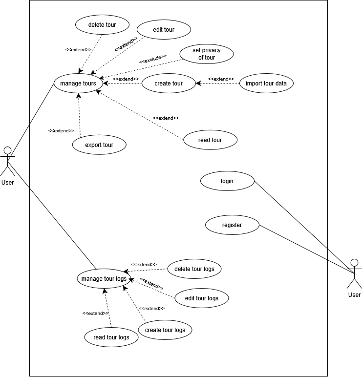

# Development Protocol

## App Architecture

### Use Cases

### Class diagram

### Sequence diagram

## Decisions
## Design Patterns used
## Unique feature: Weather Forecast

## Unit tests

## Tracked time (roughly):
- UX/UI Design: ~3h
- Component & logic implementation: ~16h
- Entity implementation: ~4h
- Repository implementation: ~3h
- Service implementation: ~16h
- Controller implementation: ~12h
- Login/Register implementation: 6h
- Unit test implementation: ~2.5h
- Documentation: ~5h
- Honorable mention - Debugging: 25h

## Lessons learned:
- Keep Deliverables smaller
- Smaller commits are better, more pushes are preferable

